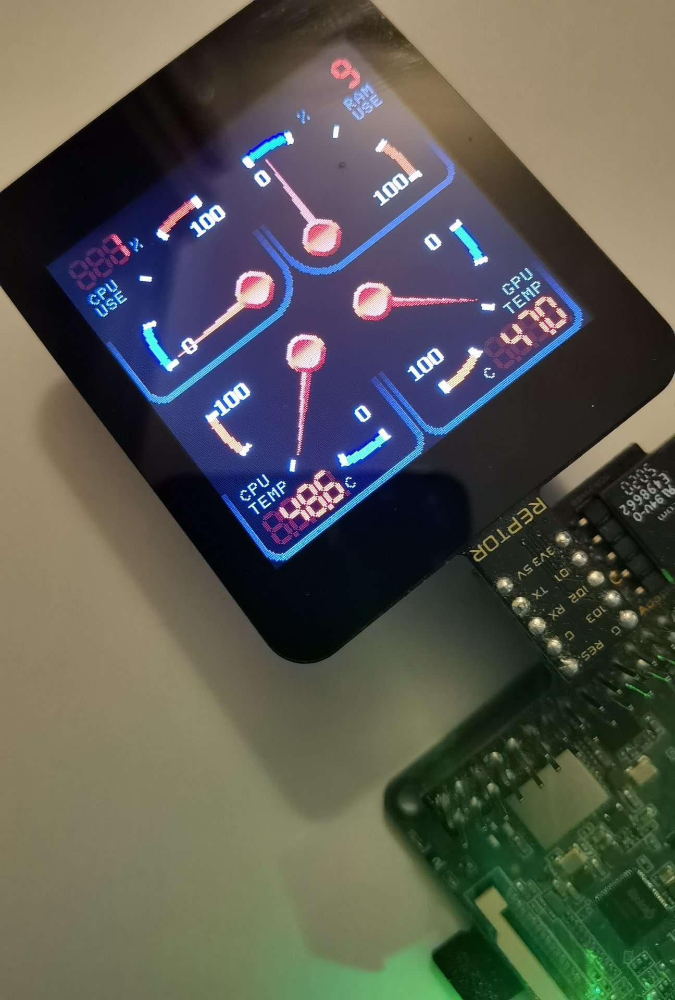

# ROCK SBC Status Monitor

Adding a status monitor to any Rock Pi project can be very useful to give at a glance real-time status of how the CPU is performing in terms of usage, temperature, and RAM use as well as vital connectivity information. If overclocking is your thing, then this can prove extremely valuable to see what impact your settings have on the ROCK SBC and adjust accordingly.

The BBM REPTOR-250 display together with the BBM Pi adapter is a perfect choice for this project due to its ease of use and the simplicity of code needed to get this up and running. 

In addition, touch allows the user to select a status page style by swiping through all options. BBM provides a Python library that makes the whole Python coding experience effortless.

**Note**: Normally, when using REPTOR-250 as a Serial UART device, it is advisable to simply use Mates Studio Architect or Commander environment since it provides a simple command protocol without the need for you to write code for the display. However, at the time of writing, Rock Pi can't be configured to disable its Serial console during boot and hence projects made using Architect and Commander environments replies with errors preventing the ROCK SBC to boot completely.

For the complete and updated documentation for this project, please refer to [ROCK SBC: Status Monitor](https://resources.breadboardmates.com/projects/RockPi/status-monitor/)